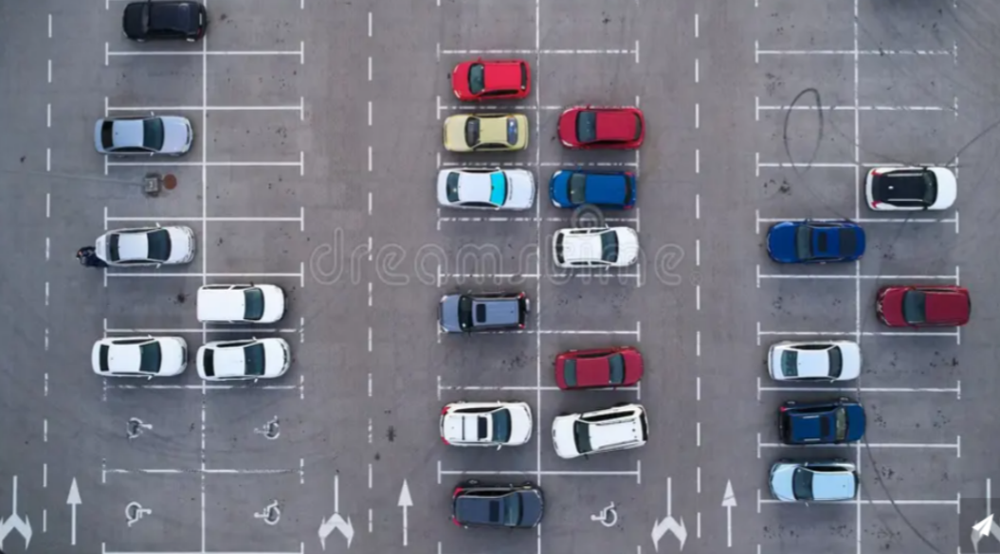

# Smart Car Parking System

Automated parking slot detection using Computer Vision. The system analyzes a parking lot image or video feed and automatically identifies occupied and vacant parking spaces in real time using OpenCV image processing techniques.

  

## 🚀 Features

Detects cars and counts occupied parking slots

Highlights empty slots in green and occupied in red

Real-time processing capability

Adjustable ROI (Region of Interest) parking space mapping

Simple to deploy and lightweight

Works on static images or webcam feeds

## 🧠 How It Works

Convert each frame to grayscale

Apply Gaussian Blur to reduce noise

Use Adaptive Thresholding and Morphological Filtering

Divide the frame into defined parking slot ROIs

Count white pixels inside each ROI

Decide parking status:

If pixel count < threshold → Empty (Green)

If pixel count ≥ threshold → Occupied (Red)

Display live parking status with total car count

## 🛠️ Tech Stack

Python

OpenCV

NumPy

cvzone

Pickle (for storing ROI data)

## 📂 Project Structure
Smart-Car-Parking/
│
├── main_code.py      # Main parking detection script
├── ROI.py            # Parking slot marking tool
├── ROI / ROI_picker  # Saved ROI positions
├── before img.png    # Parking lot image
├── ParkLot2.png      # Demo reference
└── README.md

## 🔧 Installation

Make sure Python 3.x is installed.

Install required libraries:

pip install opencv-python cvzone numpy

## 📝 Setup Instructions
1️⃣ Define Parking Slots (ROI Creation)

## Run:

python ROI.py

Left click → Add parking slot

Right click → Remove slot
ROIs are saved automatically.

2️⃣ Run Parking Detection
python main_code.py

The system will:

Process the image

Highlight parking slots

Display live car count

## 📊 Output

Green Box → Empty Slot

Red Box → Occupied Slot

Status Display → Cars: X / Total

🔍 Customization

You can tweak:

ROI size

Threshold values

Input image/video source

Kernel size

Inside main_code.py, adjust:

width, height
threshold value
kernel size

## 🎯 Applications

Shopping malls

Smart cities

Offices and tech parks

Residential complexes

University parking systems

## 📌 Future Improvements

If you want to make this project stronger, here is what is realistically useful instead of feel-good fluff:

Video-stream live parking monitoring

IoT integration with sensors

Mobile app dashboard

Cloud-based monitoring

License plate recognition

## 🧑‍💻 Author

## Ravi Ajay Gawade
